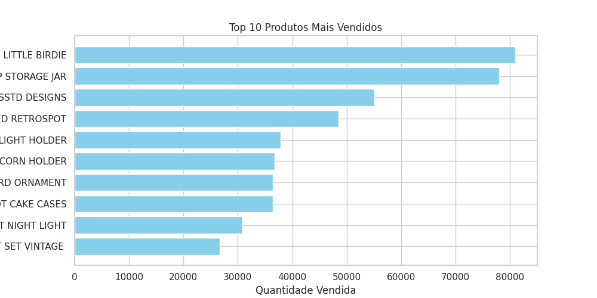
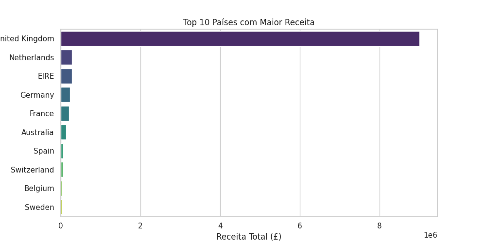
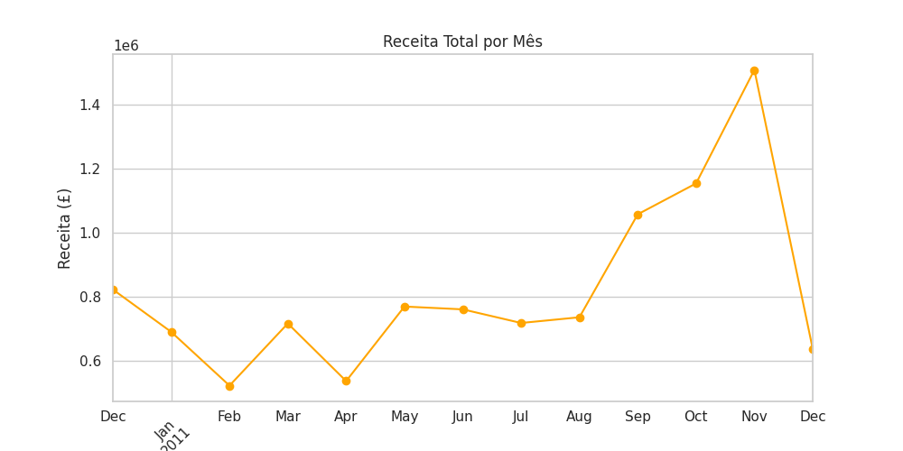

# 📊 Análise Exploratória de Vendas - E-commerce

## 🎯 Objetivo
Este projeto tem como objetivo analisar os dados de vendas de um e-commerce, identificando padrões de compra, produtos mais vendidos e a distribuição de receita por país e por mês.  
O projeto mostra a aplicação prática de análise exploratória de dados (EDA) utilizando Python.

---

## 🧩 Etapas do Projeto
1. **Importação de Bibliotecas:** Pandas, Matplotlib, Seaborn  
2. **Carregamento do Dataset:** Leitura do CSV com codificação compatível com caracteres especiais (latin1)  
3. **Entendimento da Base:** Inspeção de colunas, tipos de dados, estatísticas descritivas e valores nulos  
4. **Limpeza de Dados:** Remoção de linhas nulas e valores negativos, criação da coluna `Total`  
5. **Análise Exploratória:**
   - Top 10 produtos mais vendidos  
   - Receita total por país  
   - Receita total por mês  
6. **Geração de Insights:** Observações relevantes sobre padrões de venda e comportamento de clientes  

---

## 💡 Principais Insights
- Produtos de decoração e presentes estão entre os mais vendidos  
- O Reino Unido concentra a maior parte das vendas  
- Receita aumenta consistentemente em alguns meses  
- Produtos com alta quantidade vendida nem sempre têm alto ticket, enquanto produtos com baixa venda podem gerar alto faturamento  

---

## 📊 Tecnologias e Ferramentas
- **Python**: Pandas, Matplotlib, Seaborn  
- **Notebook**: Google Colab ou Jupyter Notebook  
- **Conceitos**: Análise Exploratória de Dados, Limpeza de Dados, Visualização de Dados, Insights de Negócio  

---

## 📂 Estrutura de Arquivos

### 📈 Top 10 Produtos Mais Vendidos

### 🌍 Receita Total por País

### 📅 Receita Total por Mês

